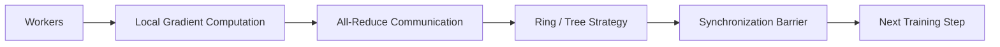
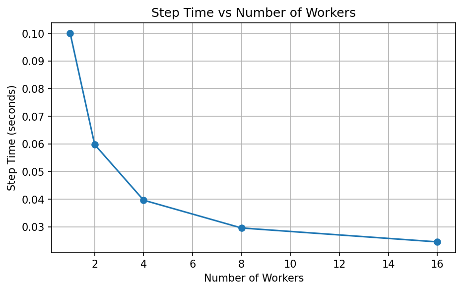
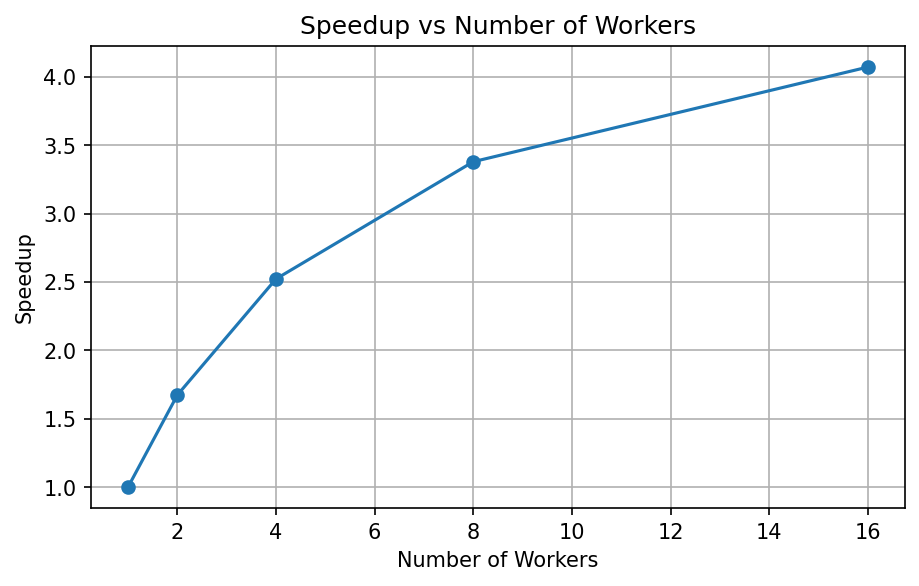
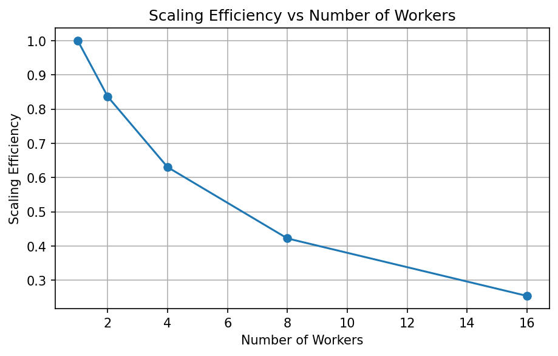
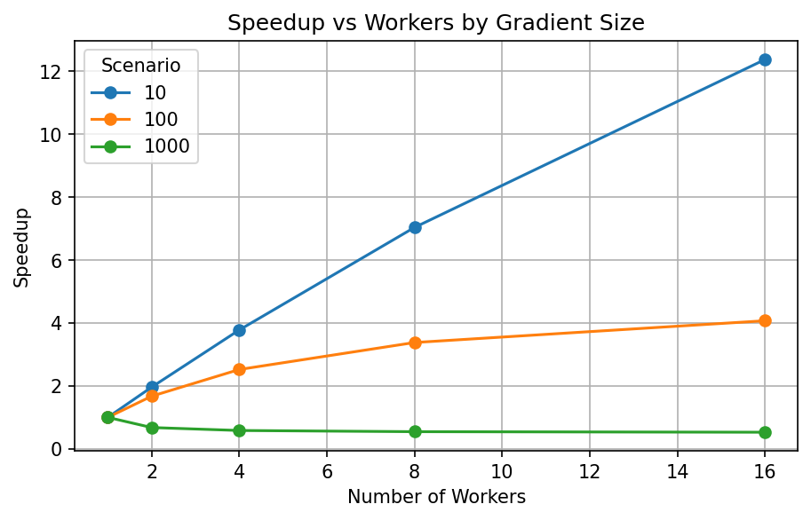
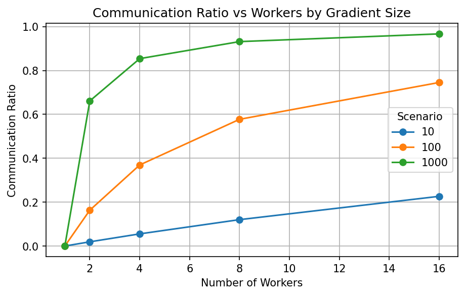
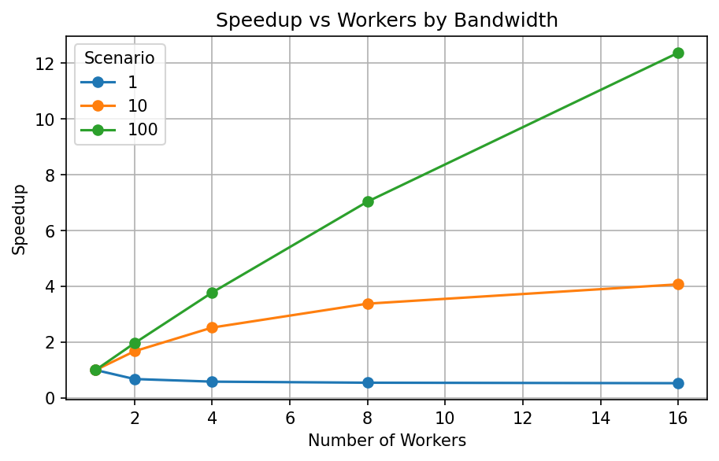
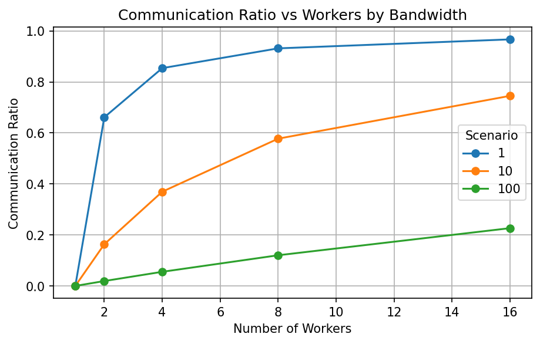
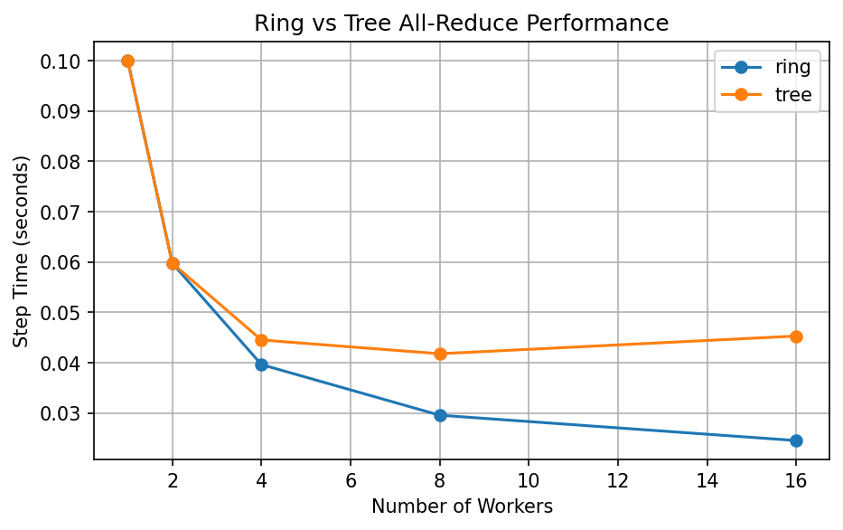

<div align="center">

# distml-core
### A distributed training simulator that models data-parallel learning, all-reduce communication, and system-level trade-offs between computation and communication.

</div>

---

## Overview

This project simulates distributed training behavior under different system configurations to understand scalability limits and bottlenecks.

It models:

- Data-parallel training
- All-reduce communication strategies (Ring, Tree)
- Compute vs communication trade-offs
- Scaling efficiency under varying conditions

---

## Key Results

- Achieved near-linear scaling (efficiency ~0.77) for small models (10 MB)
- Identified transition from **compute-bound → communication-bound** at ~8 workers
- Demonstrated **negative scaling** for large models (1000 MB)
- Showed network bandwidth as a critical factor (1 GB/s → poor scaling, 100 GB/s → near-linear)
- Compared ring vs tree all-reduce, with ring showing better scalability in this configuration

---

## Architecture

The simulator models a typical data-parallel training loop:



---

## Features

- Ring all-reduce communication model
- Tree all-reduce communication model
- Data-parallel compute scaling
- Step time, speedup, and efficiency calculation
- Communication ratio and bottleneck detection
- Multi-dimensional experiments:
  - Worker scaling
  - Gradient size sensitivity
  - Bandwidth sensitivity
  - Strategy comparison (ring vs tree)

---

## Key Metrics

| Metric | Description |
|---|---|
| Step Time | Total training step duration |
| Speedup | Relative improvement vs single worker |
| Scaling Efficiency | Speedup / number of workers |
| Communication Ratio | Fraction of time spent in communication |
| Bottleneck | Compute-bound vs Communication-bound |

---

## Scaling Results

```text
workers  step_time  speedup  efficiency  comm_ratio  bottleneck
1        0.1000     1.00     1.00        0.00        compute-bound
2        0.0598     1.67     0.84        0.16        compute-bound
4        0.0396     2.52     0.63        0.37        compute-bound
8        0.0296     3.38     0.42        0.58        communication-bound
16       0.0246     4.07     0.25        0.75        communication-bound
```

---

## Gradient Size Sensitivity

- **10 MB** → Near-linear scaling
- **100 MB** → Moderate scaling
- **1000 MB** → Communication dominates, leading to negative scaling

---

## Bandwidth Sensitivity

- **1 GB/s** → Communication-bound, poor scaling
- **10 GB/s** → Moderate scaling
- **100 GB/s** → Near-linear scaling

---

## All-Reduce Strategy Comparison

In this configuration:

- Ring all-reduce shows better scalability at higher worker counts
- Tree-based aggregation introduces higher communication overhead for deeper hierarchies

---

## Benchmark Graphs

### Worker Scaling





### Gradient Size Impact




### Bandwidth Impact




### Strategy Comparison



---

## Engineering Insights

- Distributed training transitions from **compute-bound → communication-bound** as scale increases
- Larger models significantly degrade scaling efficiency due to communication overhead
- Network bandwidth is a critical system bottleneck
- Ring all-reduce provides better scaling characteristics than tree-based aggregation in this model
- Communication overhead can completely negate parallelism at large scale

---

## Design Decisions

- Modeled communication using analytical approximations for ring and tree all-reduce
- Assumed ideal data-parallel compute scaling (perfect workload partitioning)
- Focused on simulation to isolate system-level effects without implementation complexity
- Prioritized interpretability and controlled experiments over real distributed execution

---

## Limitations

- Assumes perfect load balancing across workers
- Does not model stragglers or hardware heterogeneity
- Ignores latency and synchronization costs beyond bandwidth
- Uses simplified analytical communication models

---

## Project Structure

```text
distml/
    simulator.py
    all_reduce.py

examples/
    run_simulation.py
    gradient_size_experiment.py
    bandwidth_experiment.py

benchmarks/
    benchmark_scaling.py
    benchmark_gradient_size.py
    benchmark_bandwidth.py
    benchmark_all_reduce_strategies.py

scripts/
    plot_scaling.py
    plot_experiments.py
    plot_all_reduce_strategies.py

results/
    *.csv
    *.png
```

---

## Usage

Run simulations:

```bash
PYTHONPATH=. python examples/run_simulation.py
PYTHONPATH=. python examples/gradient_size_experiment.py
PYTHONPATH=. python examples/bandwidth_experiment.py
```

Run benchmarks:

```bash
PYTHONPATH=. python benchmarks/benchmark_scaling.py
PYTHONPATH=. python benchmarks/benchmark_gradient_size.py
PYTHONPATH=. python benchmarks/benchmark_bandwidth.py
```

---

## Tech Stack

- Python
- Matplotlib
- PyTest

---

<div align="center">

*Omprakash Sahani — Machine Learning Systems Engineer (Early Career)*

</div>
